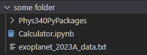

# Python Library specfically for Phys 340 Atmosphere physics

<br>

How to import functions and variables:
```py
# Custom Packages
from Phys340PyPackages.myData import (
    molecules_names,
    molar_mass,
    column_names,
    read_exoplanetA,
    read_num_densities
)
from Phys340PyPackages.main import (
    mass_den,
    effective_mm_q,
    effective_mm_ep,
    spec_humidity,
    mass_frac,
    clau_clap_eqn,
    dewpoint_temp,
    kelvin_eqn
)

from Phys340PyPackages.myPlots import (
    plot_vs_pressure
)
```

<br>

The `Calculator.ipynb` file needs to be moved outside the `Phys340PyPackages` folder. Otherwise the import paths of the modules will not work. Same with the data file `exoplanet_2023A_data.txt`, which can be found in the `myData` folder. <br>

For Example:<br>



